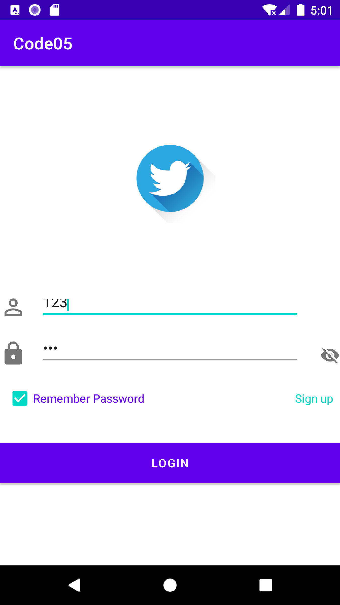

# 第八个项目——登陆界面2

## 实验目的

- 掌握SharedPreferences进行轻量级数据存储的方法；

## 实验要求

- 使用SharedPreferences保存用户登录信息；
- 使用SharedPreferences读取用户登录信息，并填充相应控件；

SharedPreferences所存储的xml文件存放于设备的/data/data/[package_name]/shared_prefs目录下，其中package_name为App的包名:

``` xml
<?xml version='1.0' encoding='utf-8' standalone='yes' ?>
<map>
    <boolean name="login_remember_password" value="true" />
    <string name="login_password">123</string>
    <string name="login_account_name">123</string>
</map>
```

# 效果



# 参考

https://xxgqin.gitbook.io/android/ch04/ch04-1